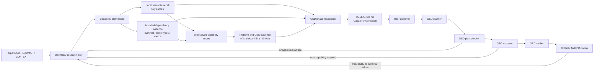

# OpenGSD Capability Discovery and Reuse-First Governance Design

**Date:** 2026-07-20
**Status:** Approved architecture; migration implemented and review repair incorporated
**Scope:** Project workflow, capability discovery, planning admission, and the R-01 pilot

## 1. Problem

R-01 exposed a process failure rather than only a poor refactor:

- planning focused on rearranging code instead of questioning whether the capability already existed;
- differently named but behaviorally equivalent local code was easy to miss;
- installed music and audio dependencies were not systematically inspected for exact APIs;
- public OSS and platform APIs were searched inconsistently;
- a planner could introduce helpers, hooks, protocols, or services after research without reopening the decision;
- process enforcement grew into a second control plane with validators, status vocabulary, and synthetic conformance cases;
- repeated reruns consumed time without proving real code deletion or meaningful Code Health improvement.

The replacement must improve discovery and decision quality without building another workflow engine.

## 2. Goals

1. Use OpenGSD as the only project lifecycle and roadmap control plane.
2. Search local code by behavior, not only names and directory structure.
3. Inspect installed, transitive, platform, and public OSS capabilities before permitting new generic logic.
4. Keep research decisions traceable into plans and implementation diffs.
5. Keep lifecycle policy in one small, stateless skill and final PR review in one thin, read-only skill indexed by `AGENTS.md`.
6. Keep indexes and search caches disposable and outside project state.
7. Validate the design with one real R-01 end-to-end pilot rather than a synthetic validator suite.
8. Preserve completed legacy delivery and every still-unimplemented capability without inheriting the unfinished legacy plan decomposition.

## 3. Non-goals

- No custom workflow runner or wrapper around OpenGSD.
- No replacement for OpenGSD roadmap, phase, pause, resume, or verification state.
- No new status ledger, graph database, capability database, telemetry, attestation, or manifest.
- No project-specific JavaScript validator for semantic decisions.
- No default Graphify, Intel, CodeQL database, or parallel code-map subsystem.
- No claim that prompt policy is an unbypassable machine gate.
- No R-01 implementation decision in this design document.

## 4. Top-level architecture



### 4.1 Control plane

OpenGSD owns:

- project and milestone roadmap;
- phase context and research;
- plan, execution, pause, resume, and verification lifecycle;
- cross-session project state;
- normal OpenGSD artifacts such as `STATE.md`, `SUMMARY.md`, and `VERIFICATION.md`.

The Metronome policy does not duplicate those responsibilities.

Legacy migration separates historical evidence, completed delivery, product truth, and future planning instead of forcing them into one roadmap:

- The tracked `docs/v1/` tree becomes the frozen raw legacy archive. It retains the original 13 packs, 132 slice identities, old status data, plans, and evidence. The eight tracked lifecycle entrypoints receive a clear archive marker stating that they are historical sources, not current lifecycle authority. The local `docs/v1/code-review-workflow.md` remains ignored, untracked, and uncommitted and is absent from migration diff, index, staging, and commit scope. `.git/info/exclude` is not modified. The file's local bytes and local edit history are outside migration acceptance.
- OpenGSD milestone history imports only the eight completed packs, 83 verified slices, and 32 evidence-backed Complete capabilities. Completed pack IDs, names, capability IDs, and evidence remain immutable historical facts. The five unfinished packs and 49 not-started slices are not imported as active or future OpenGSD phases.
- The semantic capability baseline retains all 64 original capability IDs as an exact disjoint union: 32 evidence-backed Complete capabilities in the archived v1.0 requirements plus 32 Pending/unimplemented capabilities in dormant native OpenGSD seeds. Pack completion never upgrades a broader product capability without evidence.
- After the v1.0 migration, the primary repository is semantically between milestones: `STATE.md` preserves milestone `v1.0` / `Legacy Delivered Baseline` with native `Awaiting next milestone` status, `Phase: Milestone v1.0 complete`, and `Plan: —`; its current roadmap has zero phases and zero plans, and it has no current `REQUIREMENTS.md`. The next real product milestone begins only through native `$gsd-new-milestone` after governance acceptance.
- The R-01 Level 2 proof is governance evaluation, not primary-repository product lifecycle state. Its only execution contract is the pending isolated pilot plan, which uses an independent repository at historical base `eb1730205784a88c0a5b6177d9c31b515071b069`, defines native Phase 1 there, never advances primary-repository state, and never merges pilot code.

The 32 Pending capabilities live only as `.planning/seeds/SEED-*.md` files using OpenGSD's native dormant-seed contract. Each seed preserves one legacy capability ID, feature key, required behavior, Pending/unimplemented truth, reachable legacy-source link, frozen-roadmap link, and behavior/category-specific trigger without selecting a milestone, phase, owner, implementation, API, helper, or dependency.

The semantic audit's five corrected false completions remain dormant seeds: `sessions.event-timeline`, `sessions.segment-sessions`, `sessions.session-history-grouping`, `practice-session.event-timeline`, and `practice-session.segment-history`. They do not create Phase 3.1 and do not reopen completed Pack 3 history.

Future planning uses native `$gsd-new-milestone` questioning. The pinned workflow discovers `SEED-*.md`, surfaces seeds whose triggers match the user's milestone goals, feeds selected seed context into requirement definition, and leaves unselected seeds untouched. Surfacing or selection alone does not consume a seed.

One deferred legacy capability always has exactly one authoritative carrier. Before approval, that carrier is the dormant seed. Keep a selected seed until an approved current `REQUIREMENTS.md` contains the same legacy capability ID, feature key, and required behavior; delete the seed in that same planning commit. If the requirement is not approved, keep the seed. OpenGSD does not delete seeds automatically. After promotion, native requirements, PLAN/SUMMARY/VERIFICATION artifacts, and milestone archives carry implementation and completion truth, while Git history preserves the deleted seed's provenance. Never add consumed or implemented seed frontmatter or another ledger.

### 4.2 Project policy and final review

One project skill, `skills/metronome-policy/SKILL.md`, is explicitly injected through OpenGSD `agent_skills`. It is kept outside `.agents/skills` and `.codex/skills` so automatic skill discovery does not load it multiple times.

The same policy is mapped to:

- `gsd-assumptions-analyzer`
- `gsd-phase-researcher`
- `gsd-planner`
- `gsd-plan-checker`
- `gsd-executor`
- `gsd-verifier`

This `agent_skills` mapping injects the policy only into those six subagents. It does not reach the native `$gsd-new-milestone` controller and does not mean that every lifecycle actor receives the policy.

The foundation target was approximately 80 lines of role-specific obligations without lifecycle orchestration, model routing, stage names, promotion vocabulary, or duplicated test commands. Whole-branch review later added only the narrow `Dormant seed promotion` carrier-transfer rule. That rule does not create a lifecycle stage, status, wrapper, or second control plane.

Final pull-request review uses a separate thin skill at `skills/reviewing-metronome-prs/SKILL.md`, with generated UI metadata in `agents/openai.yaml`. Root `AGENTS.md` remains thin: it routes native OpenGSD lifecycle work, supplies one `$gsd-new-milestone` controller rule to read `Dormant seed promotion` and perform the approved same-commit carrier transfer, and directs `@codex` to the final-review skill. The reviewer discovers the current `.planning` authority, conditionally loads `skills/metronome-policy/SKILL.md` for production behavior or surface changes, reconciles the real diff to Capability Admission, Approved Surface, plans, tests, and verification, and reports findings without editing or merging.

The review skill is not injected into OpenGSD agents and does not orchestrate lifecycle state. The policy governs the six mapped subagents; the milestone controller receives only the explicit root `AGENTS.md` handoff at the requirement-approval boundary; the final-review skill governs one read-only terminal audit.

The current `.agents/skills/metronome-workflow/SKILL.md` and role packets cannot coexist as a second orchestrator. Their required semantics must either move into native OpenGSD configuration/artifacts or retire. They must not be wrapped by the new policy.

### 4.3 External providers

- **Local semantic recall:** Ory Lumen, using local Ollama or LM Studio embeddings and a disposable SQLite/sqlite-vec index outside the repository.
- **Exact local confirmation:** `rg`, TypeScript types, call sites, tests, and the existing Semgrep rules where applicable.
- **Installed API evidence:** `package.json`, lockfile, installed declaration files, package source, and official documentation for the locked version.
- **Online documentation:** OpenGSD's native documentation providers such as Context7, Ref, and Jina.
- **Public OSS discovery:** OpenGSD's Exa/web provider route and official GitHub repositories.
- **Known-page extraction:** Firecrawl/Jina only after a relevant official URL is known.
- **Cross-file data flow:** CodeQL only when a specific candidate requires global call/data-flow proof; it is not a default discovery provider.

OpenGSD codebase maps may help orientation but are not semantic evidence. Graphify and Intel remain disabled because their OpenGSD query paths are substring/topology lookup, not local embedding recall, and they introduce additional persistent indexes.

## 5. Discovery levels

Every task still enters OpenGSD. Discovery depth is selected before planning.

### Level 0: mechanical exemption

All of these must be true:

- no production behavior change;
- no dependency graph change;
- no API, type, schema, or persisted-format change;
- no new branching, transformation, validation, fallback, or state;
- the work is documentation, copy, formatting, generated output refresh, or a provable pure rename/move.

Small diff size, one file, private visibility, or a `refactor` label are not exemption evidence.

### Level 1: local reuse sweep

Every production behavior change runs at least:

- capability atomization;
- Lumen local semantic recall;
- exact confirmation of local candidates;
- inspection of applicable directly installed APIs;
- candidate adoption or rejection evidence in `RESEARCH.md`.

This level covers bounded behavior changes inside a known owner when no generic capability or new architectural surface is introduced.

### Level 2: full capability discovery

Any one of these conditions upgrades the task:

- the behavior remains meaningful after feature-specific names are removed;
- equality, diffing, parsing, validation, serialization, caching, retry, search, indexing, scheduling, state-machine, date/time, or storage logic is involved;
- music/audio primitives such as beat, time signature, duration, pitch, MIDI, recording, waveform, transport, or audio analysis are involved;
- a helper, service, repository, adapter, protocol, schema, public API, dependency, or generic algorithm may be added or changed;
- local search finds multiple semantic owners or cannot confirm a unique owner;
- the goal is slimming, duplicate consolidation, Code Health improvement, or hotspot refactoring;
- existing behavior will be deleted or replaced;
- researcher, planner, or reviewer confidence is insufficient.

R-01 is Level 2 because it is a slimming/hotspot refactor involving music/audio behavior and commodity capabilities.

Ambiguity always upgrades the level. `quick`, `fast`, or `--skip-research` is not used for production behavior changes unless the user explicitly accepts the bypass.

## 6. Semantic and OSS search protocol

### 6.1 Capability atoms

A capability atom describes:

- intent;
- inputs and outputs;
- invariants and boundary behavior;
- side effects;
- lifecycle and current owner;
- domain synonyms.

Queries derive from behavior, state transition, ownership, and side effects. A function or package name alone is not a capability definition.

### 6.2 Local search

Lumen returns candidate functions, types, and modules by meaning. It does not decide equivalence. Each credible candidate is confirmed through source, call sites, types, and tests and receives either an adoption decision or a concrete mismatch reason.

No Lumen result is not proof of absence. An unhealthy or unavailable local semantic index leaves the evidence incomplete.

### 6.3 Dependency and OSS waterfall

1. Search local implementations and applicable directly installed dependencies.
2. Inspect relevant transitive dependencies, distinguishing accidental availability from an explicit decision to promote a package to a direct dependency.
3. For unresolved Level 2 atoms, search platform APIs and mature OSS implementations.
4. Verify candidates against official source, official documentation, release notes, registry provenance, and the exact version.
5. Send only abstract capability descriptions to online search; never upload private source snippets.

The R-01 dependency lane must explicitly consider current music/audio packages, including `wavesurfer.js`, `tone`, `@tonaljs/duration-value`, `@tonaljs/time-signature`, and applicable transitive packages such as `dequal`. A package name is not sufficient: the research output must identify the exact API and its behavioral fit or mismatch.

## 7. Native artifact contract

No new discovery file or state schema is introduced.

### 7.1 `RESEARCH.md`: what is allowed

```markdown
## Capability Admission

| ID | Required behavior | Local candidates | Dependency/API candidates |
| OSS/platform candidates | Decision | Rejections and mismatch |
| Approved surface | Evidence |
```

Each capability receives a simple `CAP-xx` reference. This is a traceability label, not a state machine.

Allowed decisions:

- `USE_LOCAL`
- `USE_INSTALLED_API`
- `PROMOTE_TRANSITIVE`
- `USE_PLATFORM_API`
- `ADD_OSS`
- `LOCAL_NO_FIT`
- `NEEDS_SCOPE_DECISION`

`LOCAL_NO_FIT` requires completed local, dependency, and official OSS/platform evidence plus mismatch reasons. An unavailable provider, an empty search result, or an agent assertion is insufficient.

`Approved surface` states which dependency, module, symbol, algorithm, or owner change may be introduced. An empty value permits no new production surface.

### 7.2 `PLAN.md`: how an approved choice is executed

- every production task references its `CAP-xx`;
- actions name the exact reused symbol/API and observable behavior;
- new dependencies, shared helpers, services, hooks, modules, protocols, and generic algorithms must appear in `Approved surface`;
- planning does not reopen library selection or widen the approved surface;
- missing, unresolved, or contradictory CAP evidence returns the task to research.

## 8. Role boundaries

| Role | Responsibility | Prohibited |
|---|---|---|
| Assumptions analyzer | Atomize behavior; find local semantic candidates, owners, and unknowns | Choose OSS, admit an implementation, or design a file structure |
| Phase researcher | Be the only `RESEARCH.md` writer; verify local, dependency, platform, and OSS evidence; decide or block each CAP | Prewrite implementation or disguise a preferred code shape as research |
| Planner | Compile approved CAP decisions into executable tasks, tests, and outcomes | Re-search, select a different library, invent a capability, or add an unapproved surface |
| Plan checker | Reconcile every production task and surface to a CAP | Repair the plan or silently fill missing admission evidence |
| Executor | Implement only the approved CAP and plan boundary | Change API/library/owner or add a generic surface through normal deviation rules |
| Verifier | Check real behavior, diff, tests, and CAP/PLAN traceability | Trust summary claims, edit code, or ignore an unapproved surface |

OpenGSD executor deviation rules may correct implementation mistakes only inside the approved CAP boundary. A new dependency, shared surface, business algorithm, owner move, or API replacement stops execution and returns only the affected CAP to research.

The independent final reviewer is `@codex` using `skills/reviewing-metronome-prs/SKILL.md`. It discovers current planning inputs, reads source, `RESEARCH.md`, `PLAN.md`, the real diff, tests, and verification evidence, and conditionally reads the lifecycle policy for production behavior or surface changes. It is not another policy-injected lifecycle agent and does not edit artifacts or merge the pull request.

## 9. Data flow and recovery

1. `CONTEXT.md` captures the goal, behavior boundary, and user decisions without selecting an implementation.
2. OpenGSD research-only records the Discovery level and produces Capability Admission evidence.
3. Incomplete evidence, conflicts, or `NEEDS_SCOPE_DECISION` pause in native OpenGSD state before planning.
4. User approval authorizes a normal OpenGSD planning run.
5. Plan checker reconciles `PLAN -> CAP` before execution.
6. Executor and verifier compare actual production surfaces to the approved contract.
7. A newly discovered capability invalidates only its affected CAP and plan tasks.

Provider failures are fail-closed for required evidence:

- Lumen unavailable or unhealthy: local semantic evidence remains incomplete;
- online provider unavailable: use the native provider fallback; if no authoritative source is available, remain incomplete;
- lockfile, installed types, and online documentation disagree: the locked version's installed type/source evidence wins, otherwise stop;
- multiple fitting candidates with scope or maintenance trade-offs: request a user decision.

No approval database or invalidation ledger is added. OpenGSD pause/resume preserves workflow context; paths, versions, APIs, and evidence links in `RESEARCH.md` make a targeted refresh reproducible.

## 10. Context and token control

- Do not rebuild a repository graph or code map for every task.
- Reuse the local incremental Lumen index.
- Limit each phase to its decision-bearing capability atoms, normally three to seven.
- Search local code and installed APIs before sending unresolved atoms online.
- Pass paths, APIs, versions, and short mismatch reasons to the planner, not raw search results or full webpages.
- Refresh only atoms whose requirements, relevant source, dependency version, or evidence changed.
- Do not dispatch multiple agents over the whole repository when one scoped provider query is sufficient.

## 11. Validation

The design is validated with one real R-01 end-to-end pilot, not a synthetic conformance suite.

### 11.1 Migration acceptance

- `docs/v1/` remains available, and its eight tracked lifecycle entrypoints are visibly marked as frozen, non-authoritative legacy sources; the local review tutorial remains ignored, untracked, and uncommitted and is absent from migration diff, index, staging, and commit scope; `.git/info/exclude` is not modified; its local bytes and local edit history are outside migration acceptance;
- OpenGSD milestone history contains the eight completed packs and 83 verified slices, but no active phase derived from the five unfinished packs or 49 not-started slices;
- the semantic baseline contains every original capability ID and feature key exactly once across 32 archived Complete requirements plus 32 dormant native seeds, with no intersection and with all five corrected false completions still Pending/unimplemented;
- every seed has native dormant frontmatter, a reachable legacy-source link, a link to the frozen v1.0 roadmap, and a trigger usable by `$gsd-new-milestone`; surfacing or selection keeps the seed, and the same planning commit that approves a requirement with the matching legacy ID, feature key, and behavior deletes it;
- review verifies the one-carrier invariant immediately after requirement approval and again after completion or archival: dormant seed before approval, native requirement and lifecycle artifacts afterward, never both;
- the primary repository is between milestones with zero current phases, zero current plans, no current `REQUIREMENTS.md`, and no current artifact mapping R-01 or a Pending capability to a phase;
- the isolated historical-base pilot plan is the only R-01 execution contract and its code never merges;
- the earlier pre-repair candidate passed one normal hook on a predecessor tree, but review required this repair; promotion requires one new normal full-hook pass on the exact repaired candidate, as an explicit review-driven validation rather than a blind retry.

### 11.2 Connection smoke

- the project loads one policy source;
- all six OpenGSD agent mappings resolve to it;
- the legacy orchestrator is not auto-loaded;
- root `AGENTS.md` retains native OpenGSD lifecycle routing, supplies exactly one selected-seed promotion controller seam, and separately indexes the thin final-review skill; it adds no wrapper or second control plane;
- the final-review skill and generated `agents/openai.yaml` validate, and the skill is not injected into OpenGSD roles;
- Lumen health and local index status are valid.

### 11.3 Research acceptance

- R-01 is classified as Level 2;
- capability atoms describe behavior rather than a predetermined hook/module shape;
- local semantic candidates have paths and dispositions;
- installed and transitive music/audio candidates have exact API/version evidence or concrete no-fit reasons;
- unresolved generic atoms receive official platform/OSS research;
- no unresolved CAP is marked ready for planning.

### 11.4 Plan and execution acceptance

- every production task and new surface is traceable to a CAP;
- the plan introduces no unapproved helper, hook, protocol, dependency, service, or algorithm;
- the implementation preserves required behavior with tests;
- the R-01 outcome demonstrates real responsibility consolidation and code retirement rather than moving complexity into coordination code;
- production LOC, retired LOC, Code Health, and behavior evidence are reported separately;
- any new production surface in the diff is both necessary and approved.

### 11.5 Independent acceptance

The `@codex` final reviewer discovers and evaluates current `.planning` authority, actual source, exact APIs, research Capability Admission and Approved Surface, plan, diff, tests, and quality evidence. It independently checks reuse decisions, reports retired/added/net production LOC and Code Health separately, and emits findings first with file/line and violated-contract evidence. Formatting or the presence of expected words is not proof.

### 11.6 Retry limit

- each pilot stage runs once;
- on failure, stop and classify the cause as policy gap, provider/tool failure, requirement ambiguity, or agent contract violation;
- no automatic prompt variation, artifact deletion, policy relaxation, or full-pipeline rerun;
- after explicit user approval, one affected CAP or stage may be repaired and rerun once;
- a repeated cause returns to architecture discussion instead of switching to a smaller design.

R-01 is a real engineering acceptance. If it again fails to retire code, misses relevant installed APIs, introduces unapproved coordination, or lacks meaningful quality improvement, the workflow fails even when its Markdown artifacts are well formed.

## 12. Generality and limitations

The policy and final-review skill remain general by using capability semantics, source kinds, approved surfaces, and traceability rather than R-01 paths, function names, expected helper counts, or expected diffs. R-01 validates the full Level 2 path. The first naturally occurring Level 0 and Level 1 tasks validate their cheaper paths; no artificial task corpus is maintained.

This design is a governance boundary, not a tamper-proof gate:

- `agent_skills` is prompt injection;
- OpenGSD still exposes skip flags and direct execution commands;
- a user can deliberately bypass review.

An unbypassable gate would require a wrapper, hook, CI policy, or OpenGSD modification. Those are explicitly outside the approved architecture.

## 13. Open-source decisions

- **Adopt:** OpenGSD native lifecycle and artifacts.
- **Adopt for local semantic recall:** [Ory Lumen](https://github.com/ory/lumen), pinned and treated as a rebuildable local provider.
- **Reuse:** existing `rg`, TypeScript, Semgrep, official package sources, and OpenGSD research providers.
- **Optional only:** CodeQL for specific global data-flow questions.
- **Reject as default:** mgrep because its normal architecture synchronizes files to a cloud-backed store.
- **Do not enable:** OpenGSD Graphify/Intel for semantic duplicate discovery.
- **Do not build:** a custom graph, capability registry, semantic-search engine, validator framework, or second workflow.
